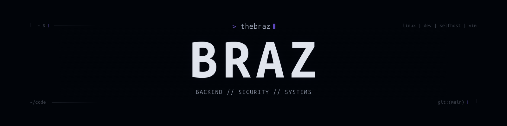
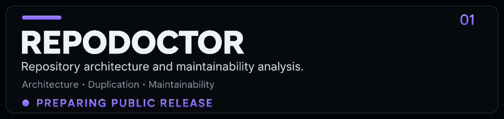

  

  <strong>Building useful software around backend systems, security and developer tooling.</strong>

  Clean architecture · Maintainability · Systems · Security

<!-- ABOUT -->

I build software with a focus on **backend engineering, maintainability, security and understanding how systems actually work**.

I like turning real problems into software that is simple to use, predictable to maintain and technically solid underneath.

Most of what interests me lives somewhere between **software architecture, developer tooling, cybersecurity, Linux and system internals**.

  <code>backend engineering</code>
  &nbsp;
  <code>software architecture</code>
  &nbsp;
  <code>security</code>
  &nbsp;
  <code>linux</code>
  &nbsp;
  <code>developer tooling</code>

<!-- CURRENT WORK -->

  

### RepoDoctor

**Repository analysis for architecture, maintainability and codebase health.**

RepoDoctor is a developer tool built to help understand what is actually happening inside a repository before structural problems become expensive.

It focuses on identifying things such as:

- duplicated or suspiciously similar code
- architectural inconsistencies
- unnecessary or misplaced files
- maintainability problems
- structural complexity
- repository organization issues
- patterns that make a codebase harder to understand and evolve

The goal is not to dump a wall of metrics.

The goal is to make repositories **easier to inspect, reason about and improve**.

  <code>TypeScript</code>
  &nbsp;
  <code>CLI</code>
  &nbsp;
  <code>Static Analysis</code>
  &nbsp;
  <code>Architecture</code>
  &nbsp;
  <code>Developer Tools</code>

  <a href="https://github.com/thebraz/RepoDoctor"><strong>View RepoDoctor →</strong></a>

<!-- TOOLBOX -->

<table align="center">
  <tr>
    <td align="center"><strong>Languages</strong></td>
    <td align="center"><strong>Backend</strong></td>
    <td align="center"><strong>Data</strong></td>
    <td align="center"><strong>Systems</strong></td>
  </tr>
  <tr>
    <td align="center">
      TypeScript 
      Java 
      C#
    </td>
    <td align="center">
      Node.js 
      APIs 
      Backend Architecture
    </td>
    <td align="center">
      PostgreSQL 
      Prisma 
      SQL
    </td>
    <td align="center">
      Linux 
      Docker 
      Git
    </td>
  </tr>
</table>

  
    I care more about understanding the tools I use than collecting as many technologies as possible.
  

<!-- GITHUB -->

I use GitHub as a place for projects that are meant to become **actual software**, not just code dumped into a repository.

Things I care about when building:

- clear project structure
- understandable architecture
- useful documentation
- maintainable code
- reproducible setup
- intentional dependencies
- meaningful releases
- software that solves a real problem

  <strong>Current direction</strong>

  <code>Developer Tools</code>
  &nbsp;
  <code>Backend Systems</code>
  &nbsp;
  <code>Security</code>
  &nbsp;
  <code>Open Source</code>

<!-- FOOTER -->

  

  BUILD · UNDERSTAND · IMPROVE

