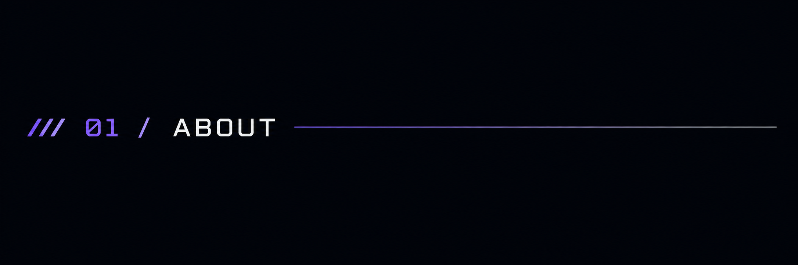
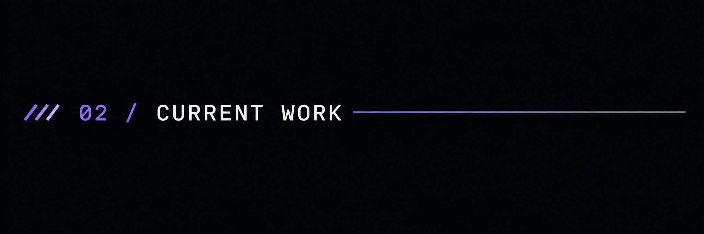
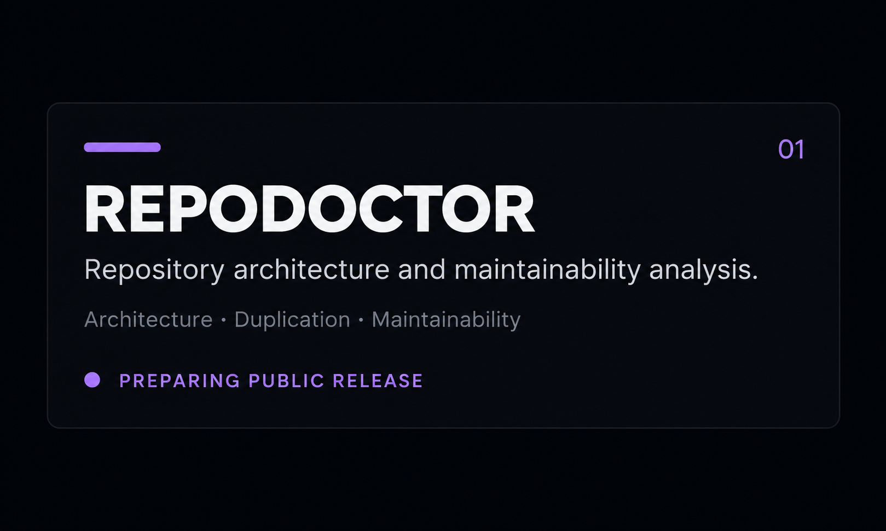
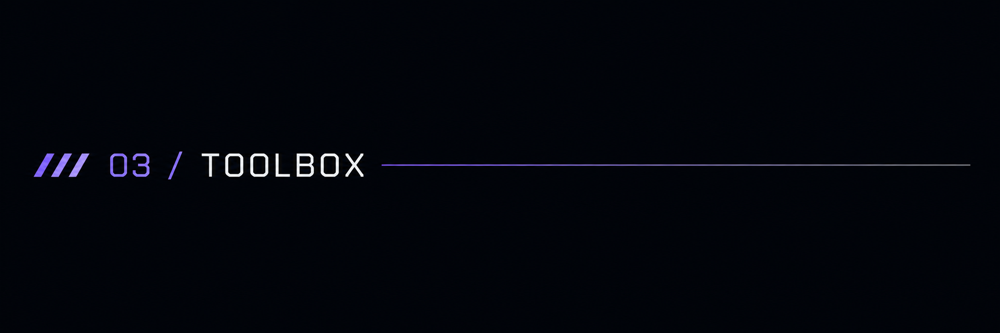
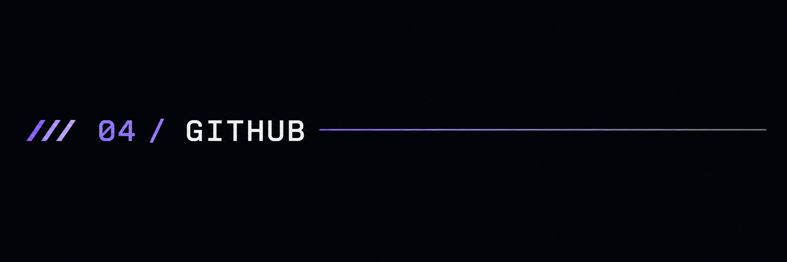
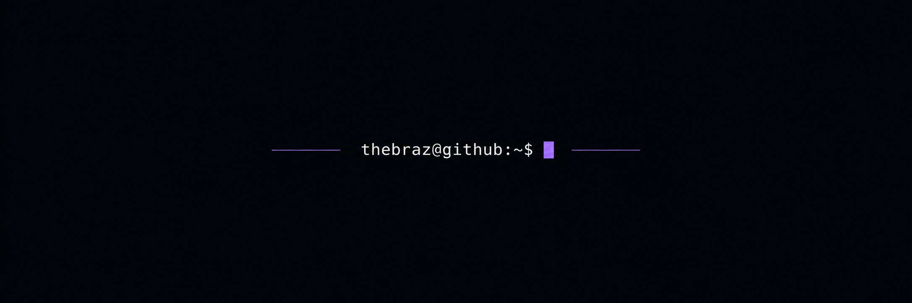

  

 

  <strong>Building useful software around backend systems, security and developer tooling.</strong>

  Clean architecture · Maintainability · Systems · Security

 

 

I build software focused on solving real problems while keeping the codebase clean, maintainable and understandable.

I'm particularly interested in backend engineering, developer tooling, cybersecurity, Linux and understanding how systems behave beneath the surface.

  

 

 

  

 

  <code>TypeScript</code>
  &nbsp;&nbsp;
  <code>Node.js</code>
  &nbsp;&nbsp;
  <code>Java</code>
  &nbsp;&nbsp;
  <code>C#</code>

  <code>PostgreSQL</code>
  &nbsp;&nbsp;
  <code>Docker</code>
  &nbsp;&nbsp;
  <code>Linux</code>
  &nbsp;&nbsp;
  <code>Git</code>

  

 

  Currently building and preparing my first public developer tools.

  

  

