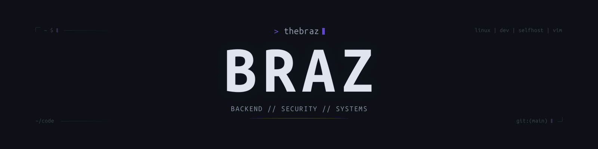

  

  Building backend systems, developer tools, and security-focused software.

---
---

## / about

I enjoy building software that solves real problems, with a focus on clean architecture, maintainability, and security.

- Building developer tools and backend systems
- Exploring cybersecurity and system internals
- Working primarily with Linux environments
- Learning how software behaves under the hood

---

## / current-focus

**RepoDoctor**  
Repository health and architecture analysis tooling. Preparing for its first public release.

**EnvGuard**  
Environment configuration and security tooling.

---

## / stack

  

---

## / github

  

  

---

  <code>BUILD // UNDERSTAND // IMPROVE</code>

